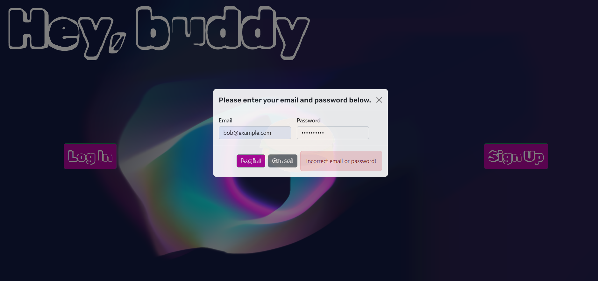
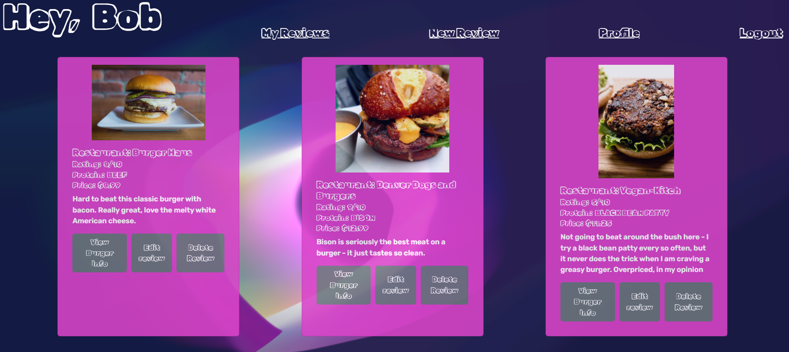

# BurgerBuddy

Welcome to BurgerBuddy, the ultimate app for hamburger enthusiasts! Experience a delightful journey as you explore and review the finest cheeseburgers at local restaurants. Inspired by my quest to uncover hidden gems in Kansas City, the heartland of exceptional beef patties, BurgerBuddy was born.

&nbsp;

## Screenshots

Error handling in login attempt.

Bob's reviews viewed upon login.

&nbsp;

<!-- edit for Render deployment!!! -->

<!-- ## Installation

Follow these steps to get BurgerBuddy up and running:

1. Clone the repository to your local machine.
2. In a new terminal window, run `bundle install` to install the necessary dependencies.
3. Run `bundle exec rake server` to initiate the backend magic.
4. Switch to a new terminal window, navigate to the client directory, and run `npm install` to install the required packages.
5. In a separate terminal window, use `npm start` to start the development server.
6. Finally, open your favorite browser and visit http://localhost:3000 to access the app and embark on your cheeseburger adventure! -->

&nbsp;

## Technologies Used 
### **Client-side:**

**React:** The foundation of our app, providing a lightning-fast and dynamic user interface. This project was bootstrapped using [Create React App](https://github.com/facebook/create-react-app), allowing for a streamlined development setup.

**ReactStrap:** [Reactstrap](https://github.com/reactstrap/reactstrap) is a Bootstrap-based CSS library used to ensure a polished and responsive design

**Vanta.js:** [Vanta.js](https://github.com/tengbao/vanta) is a JavaScript library that provides WebGL animations, allowing developers to create animated backgrounds, particle systems, and 3D visuals. Vanta.js is used for the background effects.

### **Server-side:**

**Ruby on Rails:** An object-oriented backend language, enabling robust functionality and scalability.

**Active Record:** An exceptional ORM tool that simplifies database management and enhances data handling.

**PostgreSQL:** Reliable and efficient object-relational database for seamless data storage and retrieval.

**BCrypt:** Employed for top-notch password protection and authentication, ensuring the security of user information.

&nbsp;

## License

[MIT](https://choosealicense.com/licenses/mit/)

sudo service postgresql start
rails server